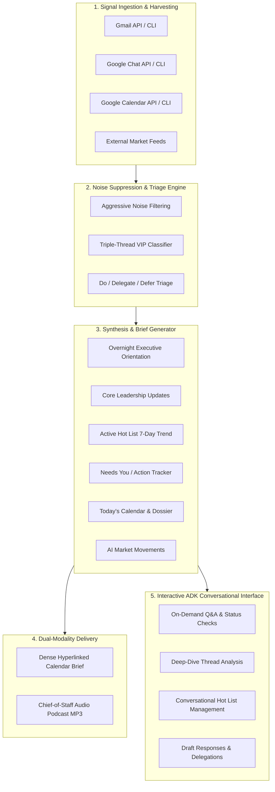

# Product Requirements Document (PRD)
## Project: Daily Brief Autonomous ADK Agent
**Document Version:** 1.0 (Step 1: Functional Specification)  
**Status:** In Review  
**Target User / Principal:** Robert Sibo (`rsibo@google.com`), Head of AI/Gemini Technical Go-to-Market (AuNZ)  
**Framework:** Google Agent Development Kit (ADK) & `agents-cli`  
**Workspace:** `/usr/local/google/home/rsibo/sandbox/daily-brief`  

---

## 1. Executive Summary & Vision

The **Daily Brief Agent** is an autonomous executive AI agent built using the Google Agent Development Kit (ADK). It acts as an autonomous **Executive Chief of Staff and Technical Intelligence Partner** for Robert Sibo (rsibo), Head of AI/Gemini Technical Go-to-Market (Customer Engineers & Forward Deployed Engineers) for Australia & New Zealand.

### Core Philosophy
> *"Do not report the news; report what requires a decision, an escalation, or immediate strategic awareness."*

The agent eliminates communication fragmentation across Gmail, Google Chat, Google Calendar, internal documents, and rapid external AI market shifts. It aggregates, filters, prioritizes, and synthesizes raw communication signals into actionable intelligence delivered both as structured text briefings and conversational voice walkthroughs, while providing an interactive ADK tool-enabled assistant for on-demand inquiries.

---

## 2. Target Persona & Stakeholder Map

- **Principal User:** Robert Sibo (`rsibo@google.com`)
- **Reporting & Regional Leadership:**
  - Direct Manager: Simon Elisha
  - Senior & Regional Leadership: Mitesh Agarwal, Vamsi Ramakrishnan, Oliver Parker, Carrie Tharp, Michael Scutt, Matthew Pancino, Paul Migliori, Harsha, Karan Bajwa, Moe Abdula
- **Immediate Direct Reports (15 Team Members):**
  - Ollie Scott, Nakul Gowdra, Tomas Lawton, Pedro Correia, Eric Zhu, Rod Williams, Dylan Dance, Langley Millard, Nicole Pinto, Brendan Hills, Jordan France, Tanya Dixit, Kevin Wang, Pouya Ghiasnezhad Omran, Ella Grier
- **Tier-1 Strategic Accounts:**
  - Woolworths, Optus, Bendigo Bank, Macquarie, Bunnings, Zip, Canva, Atlassian, Wesfarmers
- **Key Chat Spaces:**
  - AuNZ AI CE Team, AuNZ AI FDE Team, AuNZ AI Tech Team, AUNZ AISS, JAPAC AI Community & Leadership spaces

---

## 3. Core Functional Capabilities

---

### Module 1: Multi-Source Signal Harvesting & Ingestion

1. **Gmail Ingestion:**
   - Polls unread threads, recent messages from VIP senders, and threads matching priority search queries.
   - Captures thread ID, sender, recipients, timestamps, subject, snippet, full message body, and direct thread deep links.
   - Tracks incoming customer/partner escalations, commercial deal blockers, and leadership directions.

2. **Google Chat Ingestion:**
   - Scans 1:1 Direct Messages (DMs) received over the target lookback period (overnight / past 24h).
   - Scans direct @-mentions of `rsibo` across all joined spaces.
   - Monitors designated team spaces (AuNZ AI CE, FDE, Tech, AUNZ AISS, JAPAC AI rooms) for macro announcements, pricing discussions, or critical technical updates.

3. **Google Calendar Ingestion:**
   - Reads today's agenda (and rolling next 24-48h).
   - Extracts event titles, start/end times, guest lists, meeting links, agendas, and attached documents.
   - Flags tight back-to-back meetings, customer-facing sessions needing preparation, and potential scheduling conflicts.

4. **External AI Market Movements:**
   - Scans trailing 24–48h industry updates across foundation models, enterprise AI frameworks, hyperscaler AI/ML announcements (GCP, AWS, Azure), and competitive moves.
   - Gathers verified citations from credible developer/research publications.

---

### Module 2: Noise Suppression & Triage Engine

1. **Aggressive Noise Suppression (Zero Fluff Policy):**
   - Drops already-read emails and self-sent messages (unless explicitly responded to or challenged by others).
   - Suppresses automated machine notifications (GitHub/GitLab alerts, CI/CD logs, SaaS billing receipts, automated Buganizer CCs).
   - Drops mass marketing, regional HR newsletters, broad training invites, and generic blast communications.
   - Drops kudos/gThanks emails (`noreply+gthanks@google.com`) and calendar administrative churn (accept/decline receipts, automated room updates).
   - Suppresses background chatter where team members are resolving problems autonomously without requiring rsibo's decision.

2. **"Triple-Thread" VIP Classification:**
   - **Bucket A - Upward & Regional Leadership:** Pings and instructions from Simon Elisha, Mitesh Agarwal, Vamsi Ramakrishnan, Oliver Parker, Carrie Tharp, Karan Bajwa, Moe Abdula, etc.
   - **Bucket B - Tier-1 Enterprise Accounts & Blockers:** Woolworths, Optus, Bendigo Bank, Macquarie, Bunnings, Zip, Canva, Atlassian, Wesfarmers.
   - **Bucket C - Direct Reports & Team Escalations:** 1:1 DMs, hiring/personnel approvals, critical blockers, and direct mentions from the 15 direct reports.

3. **"Do, Delegate, Defer" Decision Routing:**
   - **Do:** High-urgency action items requiring direct attention or decision today.
   - **Delegate:** Technical queries or customer requests that can be routed to a specific CE/FDE owner (e.g., routing a Gemini Enterprise deep dive to Tanya Dixit or Brendan Hills).
   - **Defer:** High-value situational awareness items that do not require action today.

---

### Module 3: Structured Briefing Synthesis

The agent formats the synthesized briefing into a dense, scannable document with strict formatting standards:

1. **Overnight Executive Orientation (Top of Brief):**
   - A punchy 6-sentence summary (unbolded plain text) summarizing critical overnight communications received since 5:00 PM previous evening.
   - Written in the authoritative voice of an Executive Chief of Staff preparing the principal for their morning.

2. **Core Updates & Leadership Directives:**
   - Clustered by account or strategic topic with hyperlinked titles directly to the Gmail or Chat thread (`<b><a href="URL">Title</a></b>`).
   - Maximum 2 dense bullets per topic, specifying the recency anchor ("Last response from Vamsi was Thursday"), the current stance/concern, and the "So What" strategic context.

3. **Active Hot List Tracking (7-Day Trend Lookback):**
   - Continuously monitors designated priority initiatives:
     - *Optus VAIS & Model Armor Blocker*
     - *Woolworths (GE, FDE/SWE Initiative, FLW Shopping Agent)*
     - *Google AI DRZ / AU In-Region ML Processing*
   - Mandate: Every active theme must be reported daily. If silent for 7 days, explicitly state `"- No update in past 7 days"`.

4. **Needs You / Action Tracker:**
   - Consolidated checklist of unanswered direct questions, pending approvals, and @mentions.
   - Includes an aging indicator (e.g., "[Day 2 - Unanswered]").

5. **Today's Meeting Readiness & Schedule Dossier:**
   - Chronological breakdown of the day's commitments.
   - Includes attendee context, meeting objective, and quick prep pointers for customer or leadership meetings.

6. **Market & Hyperscaler Intelligence:**
   - Concise digest of external generative AI and cloud movements over the past 24-48 hours with verified citations.

---

### Module 4: Dual-Modality Delivery & Distribution

1. **Structured Text Briefing Delivery:**
   - Creates a 30-minute private, free (transparent) Google Calendar event (e.g., `Your Morning Brief` at 06:00 AM) containing the dense HTML description.
   - Deep links for every communication thread to allow 1-click triage from mobile or desktop.
   - Fallback/alternative: Delivery via email digest or direct message.

2. **Executive Audio Podcast Generation:**
   - Synthesizes a natural, 8–15 minute spoken briefing script from the structured brief.
   - Voice profile: Authoritative, energetic Chief-of-Staff tone (e.g., `Aoede` / `en-US-AvaNeural` at 1.05x speed).
   - Zero-fluff spoken format (no cheesy radio intros or fake banter; dives straight into the highest-priority briefing items).
   - Generates an MP3 file, uploads to Google Drive at designated briefing folder (`/agents/daily-briefing`), and pins a clickable `Listen to Brief` link at the very top of the calendar invite.

---

### Module 5: Interactive ADK Agent Tools & Conversational Workflows

When run in interactive mode (via `agents-cli playground`, Web UI, or programmatic API), the agent exposes dedicated tool-calling capabilities:

1. **`generate_daily_brief` Tool:**
   - Triggers the full intelligence ingestion and generates a fresh morning, afternoon, or custom-window brief.
   - Supports parameters for lookback window, specific focus accounts, or delivery destination.

2. **`query_communications` Tool:**
   - Allows natural language questions: *"What did Simon say about our Q3 headcount?"*, *"Summarize all recent conversations regarding the Optus blocker"*, *"What direct messages did I receive from Pedro or Nakul overnight?"*.

3. **`manage_hot_list` Tool:**
   - Adds, updates, or archives themes in the Active Hot List registry conversationally (*"Add Commonwealth Bank GenAI POC to our hot list with query keywords..."*).

4. **`draft_response` / `delegate_task` Tool:**
   - Drafts an executive-level reply to an email/chat thread, or drafts a delegation message to a direct report with full context and recommended guidance.

5. **`get_daily_schedule_prep` Tool:**
   - Provides on-demand meeting dossiers, customer relationship backgrounds, and strategic talking points for any meeting on today's calendar.

---

## 4. User Interaction & Usage Scenarios

| Scenario | Mode | User Action / Trigger | Agent Output |
| :--- | :--- | :--- | :--- |
| **Morning Autonomous Routine** | Scheduled / Background | Cron triggers at 05:45 AM Sydney time | Places `Your Morning Brief` on calendar with HTML triage agenda, uploads MP3 podcast to Drive, links audio at top of invite. |
| **Interactive Morning Catch-up** | Conversational (`agents-cli playground` / Chat) | *"Give me my 5-minute headline briefing for today."* | Summarizes top 3 urgent actions, today's critical meetings, and pending leadership pings. |
| **Topic Deep Dive** | Conversational | *"What is the latest status on the Woolworths SWE engagement?"* | Correlates Gmail and Chat threads, highlights latest message timestamps, open blockers, and next steps. |
| **Live Hot List Update** | Conversational | *"Add Project Titan to my hot list tracking."* | Updates the persistent hot list registry with search keywords, aliases, and begins daily tracking. |
| **Delegation Routing** | Conversational | *"Draft a delegation message to Tanya to handle the GE architecture review."* | Generates a pre-formatted chat message referencing the original thread context and required action. |

---

## 5. Scope Boundaries

### In-Scope (Phase 1 / MVP)
- Automated ingestion and triage from Gmail, Google Chat, Calendar, and Drive.
- Robust suppression of spam, system noise, and low-priority chatter.
- "Triple-Thread" VIP classification (Leadership, Strategic Accounts, 15 Direct Reports).
- Structured briefing generation (Overnight Orientation, Core Updates, Hot List 7-day trend, Needs You, Meeting Dossier).
- Audio script generation and TTS pipeline to MP3 + Drive upload.
- Full ADK Agent implementation with tools for interactive querying, hot list management, and briefing generation.

### Out-of-Scope (Deferred to Future Iterations)
- Autonomous sending of emails or chat messages without explicit user review/approval (agent drafts, user sends).
- Direct modification of Salesforce CRM records (read-only reference is acceptable, write-backs deferred).
- Direct integration with non-Google messaging apps (Slack, Teams, WhatsApp).

---

## 6. Functional Acceptance Criteria

1. **Triage Accuracy:** Zero noise items (receipts, mass newsletters, gThanks, automated alerts) appear in the core briefing sections.
2. **VIP Coverage:** 100% of unread communications from designated leadership and direct reports within the lookback window are triaged.
3. **Traceability:** Every cited email or chat thread in the text briefing includes a direct, working deep link to the original thread.
4. **Hot List Fidelity:** Every active theme in the Hot List registry is accounted for in every daily run, explicitly stating "- No update in past 7 days" if inactive.
5. **Actionability:** All items in "Needs You" have clear, unambiguous action summaries and aging indicators.
6. **Dual Modality:** Produces both high-density HTML calendar invite and high-quality MP3 audio file with Drive link.
7. **ADK Extensibility:** All capabilities are exposed as clean Python ADK tools usable in interactive CLI/chat mode.

---

## 7. Next Steps & Handoff

- **Step 1 (Current):** Review and finalize this Functional Specification.
- **Step 2:** User to provide Non-Functional Requirements (latency, security/data privacy, reliability, environment/tooling constraints, model selection, execution sandbox parameters).
- **Step 3:** Multi-step technical architecture and implementation plan.
- **Step 4:** Implementation of the steps.
