# Product Requirements Document (PRD)
## Project: Daily Brief Autonomous ADK Agent
**Document Version:** 1.2 (Production Architecture & End-to-End Multi-Agent Specification)  
**Status:** Implemented & Verified  
**Target User / Principal:** Robert Sibo (`rsibo@google.com`), Head of AI/Gemini Technical Go-to-Market (AuNZ)  
**Framework:** Google Agent Development Kit (ADK) & `agents-cli`  
**Workspace:** `/usr/local/google/home/rsibo/sandbox/daily-brief`  

---

## 1. Executive Summary & Vision

The **Daily Brief Agent** is an autonomous executive AI agent built using the Google Agent Development Kit (ADK). It acts as an autonomous **Executive Chief of Staff and Technical Intelligence Partner** for Robert Sibo (rsibo), Head of AI/Gemini Technical Go-to-Market (Customer Engineers & Forward Deployed Engineers) for Australia & New Zealand.

### Core Philosophy
> *"Do not report the news; report what requires a decision, an escalation, or immediate strategic awareness."*

The agent eliminates communication fragmentation across Gmail, Google Chat, Google Calendar, internal documents, and rapid external AI market shifts. It aggregates, filters, prioritizes, and synthesizes raw communication signals into actionable intelligence delivered both as structured text briefings and conversational voice walkthroughs, while providing an interactive ADK tool-enabled assistant for on-demand inquiries.

---

## 2. Target Persona & Stakeholder Map

- **Principal User:** Robert Sibo (`rsibo@google.com`)
- **Reporting & Regional Leadership:**
  - Direct Manager: Simon Elisha
  - Senior & Regional Leadership: Mitesh Agarwal, Vamsi Ramakrishnan, Oliver Parker, Carrie Tharp, Michael Scutt, Matthew Pancino, Paul Migliori, Harsha, Karan Bajwa, Moe Abdula
- **Immediate Direct Reports (15 Team Members):**
  - Ollie Scott, Nakul Gowdra, Tomas Lawton, Pedro Correia, Eric Zhu, Rod Williams, Dylan Dance, Langley Millard, Nicole Pinto, Brendan Hills, Jordan France, Tanya Dixit, Kevin Wang, Pouya Ghiasnezhad Omran, Ella Grier
- **Tier-1 Strategic Accounts:**
  - Woolworths, Optus, Bendigo Bank, Macquarie, Bunnings, Zip, Canva, Atlassian, Wesfarmers
- **Key Chat Spaces:**
  - AuNZ AI CE Team, AuNZ AI FDE Team, AuNZ AI Tech Team, AUNZ AISS, JAPAC AI Community & Leadership spaces

---

## 3. End-to-End Multi-Agent Architecture & Orchestration Flow

```mermaid
flowchart TD
    subgraph ROOT ["Master Orchestrator (DailyBriefOrchestrator: SequentialAgent)"]
        direction TB

        subgraph STAGE1 ["Stage 1: Multi-Channel Signal Harvesting (harvesters: ParallelAgent)"]
            direction LR
            GMAIL["Gmail CLI<br/>(VIP Leadership & Direct Reports)"] --> ICA["internal_comms_agent<br/>(Noise Filter & Compaction)"]
            GCHAT["Google Chat CLI<br/>(1:1 DMs, @rsibo, Priority Spaces)"] --> ICA
            GCAL["Google Calendar CLI<br/>(Today's Agenda & Prep Dossier)"] --> ICA
            
            SEARCH["Google Search Grounding<br/>(Trailing 24-72h AI Ecosystem)"] --> MNA["market_news_agent<br/>(Grounded Search & Extraction)"]
            
            ICA -->|"Emits state['harvest_data']"| HARVEST_OUT[("Harvested Internal Signals")]
            MNA -->|"Emits state['market_data']"| MARKET_OUT[("Harvested Market Intel")]
        end

        subgraph STAGE23 ["Stages 2 & 3: Executive Synthesis & Editorial Loop (editorial_loop: LoopAgent, max_iterations=4)"]
            direction TB
            BWA["briefing_writer_agent<br/>(assemble_draft_briefing)"]
            ERA["editor_reviewer_agent<br/>(lint_vp_standards & evaluate)"]
            GATE1{"Gate 1: Review Verdict<br/>(verdict == 'approve'?)"}
            
            BWA -->|"Emits state['draft_briefing']"| ERA
            ERA --> GATE1
            GATE1 -->|"verdict == 'revise'<br/>state['editor_critique']"| BWA
            GATE1 -->|"verdict == 'approve'<br/>finalize_approved_briefing()<br/>exit_loop()"| APPROVED_BRIEF[("state['final_briefing']<br/>Approved Executive HTML Briefing")]
        end

        subgraph STAGE4 ["Stage 4: Executive Audio Podcast Pipeline (podcast_pipeline: SequentialAgent)"]
            direction TB
            
            subgraph STAGE4A ["Stage 4a: Podcast Spoken Overview Editorial Loop (podcast_editorial_loop: LoopAgent, max_iterations=5)"]
                direction TB
                PSWA["podcast_script_writer_agent<br/>(Narrative Acoustic Rewriter)"]
                PERA["podcast_editor_reviewer_agent<br/>(Audio QC & Acoustic Linter)"]
                GATE2{"Gate 2: Review Verdict<br/>(verdict == 'approve'?)"}
                
                PSWA -->|"Emits state['podcast_script_draft']<br/>• Opening Hook: Let's begin; <br/>• Bracket-to-Narrative Rewriting<br/>• 6-15 min bounds (800-2400 words)<br/>• Sentence brevity <= 18 words<br/>• Contraction density >= 80%"| PERA
                PERA -->|"lint_podcast_spoken_script()<br/>evaluate_podcast_script()"| GATE2
                GATE2 -->|"verdict == 'revise'<br/>state['podcast_script_critique']"| PSWA
                GATE2 -->|"verdict == 'approve'<br/>finalize_approved_podcast_script()<br/>exit_loop()"| APPROVED_SCRIPT[("state['podcast_script']<br/>Approved Acoustic Spoken Script")]
            end
            
            subgraph STAGE4B ["Stage 4b: Audio Synthesis & Cloud Upload (podcast_creator_agent)"]
                direction TB
                PCA["podcast_creator_agent<br/>(generate_podcast_pipeline)"]
                TTS["TTS Audio Engine<br/>(edge-tts AvaNeural 1.05x / Gemini TTS)"]
                GDRIVE["Google Drive Upload<br/>(Folder: /agents/daily-briefing)"]
                
                PCA --> TTS
                TTS --> GDRIVE
                GDRIVE -->|"Emits state['podcast_asset']<br/>(drive_web_url, drive_file_id, local_file_path)"| PODCAST_OUT[("Podcast Drive Asset")]
            end
            
            APPROVED_SCRIPT --> PCA
        end

        subgraph STAGE5 ["Stage 5: Delivery & Lifecycle Retention (delivery_agent)"]
            direction TB
            DA["delivery_agent<br/>(schedule_briefing_calendar_event & cleanup)"]
            BADGE["Inject 'Listen to Brief' Badge<br/>into HTML Description"]
            GCAL_EVT["Schedule Google Calendar Event<br/>• Morning: 06:00-06:30 AEST<br/>• Afternoon: 19:00-19:30 AEST<br/>• Native Drive MP3 Attachment"]
            CLEANUP["Artifact Lifecycle Purge<br/>(cleanup_pipeline_artifacts: 7-day retention)"]
            
            DA --> BADGE
            BADGE --> GCAL_EVT
            GCAL_EVT --> CLEANUP
        end

        STAGE1 --> STAGE23
        STAGE23 --> STAGE4
        STAGE4 --> STAGE5
    end

    subgraph TRIGGER ["Automated Orchestration & Triggers"]
        CRON["OS-Level Crontab (scripts/cron_dispatch.sh)<br/>Hourly Sydney Timezone & DST Check"]
        RUNNER["scripts/run_daily_brief.py"]
        
        CRON -->|"06:00 AM Sydney (Mon-Sat)"| RUNNER
        CRON -->|"04:00 PM Sydney (Mon-Fri)"| RUNNER
        RUNNER -->|"Executes autonomously"| ROOT
    end
```

---

### Module 1: Multi-Source Signal Harvesting & Ingestion

1. **Gmail Ingestion:**
   - Polls unread threads, recent messages from VIP senders, and threads matching priority search queries.
   - **Dual-Mode Lookback Windows:**
     - **Morning Mode (`--mode morning`):** 24-hour lookback on internal communications (Gmail, Chat, Calendar) plus 72-hour lookback on frontier AI market announcements.
     - **Afternoon Mode (`--mode afternoon`):** 12-hour lookback on workday communications (since 07:00 AM Sydney time), focusing on daytime decisions, approvals, and meeting follow-ups.
   - Captures thread ID, sender, recipients, timestamps, subject, snippet, full message body, and direct thread deep links.
   - Tracks incoming customer/partner escalations, commercial deal blockers, and leadership directions.

2. **Google Chat Ingestion:**
   - Scans 1:1 Direct Messages (DMs) received over the target lookback period (overnight / past 24h for morning; past 12h for afternoon).
   - Scans direct @-mentions of `rsibo` across all joined spaces.
   - Monitors designated team spaces (`config/chat_spaces.md`: AuNZ AI CE, FDE, Tech, AUNZ AISS, JAPAC AI rooms) for macro announcements, pricing discussions, or critical technical updates.

3. **Google Calendar Ingestion:**
   - Reads today's agenda (and rolling next 24-48h) in `Australia/Sydney` timezone.
   - Extracts event titles, start/end times, guest lists, meeting links, agendas, and attached documents.
   - Flags tight back-to-back meetings, customer-facing sessions needing preparation, and potential scheduling conflicts.

4. **External AI Market Movements:**
   - Scans trailing 24–72h industry updates across foundation models, enterprise AI frameworks, hyperscaler AI/ML announcements (GCP, AWS, Azure), and competitive moves via Google Search API grounding.
   - Gathers verified citations from credible developer/research publications.

---

### Module 2: Noise Suppression & Triage Engine

1. **Aggressive Noise Suppression (Zero Fluff Policy):**
   - Drops already-read emails and self-sent messages (unless explicitly responded to or challenged by others).
   - Suppresses automated machine notifications (GitHub/GitLab alerts, CI/CD logs, SaaS billing receipts, automated Buganizer CCs).
   - Drops mass marketing, regional HR newsletters, broad training invites, and generic blast communications.
   - Drops kudos/gThanks emails (`noreply+gthanks@google.com`) and calendar administrative churn (accept/decline receipts, automated room updates).
   - Suppresses background chatter where team members are resolving problems autonomously without requiring rsibo's decision.

2. **"Triple-Thread" VIP Classification:**
   - **Bucket A - Upward & Regional Leadership:** Pings and instructions from Simon Elisha, Mitesh Agarwal, Vamsi Ramakrishnan, Oliver Parker, Carrie Tharp, Karan Bajwa, Moe Abdula, etc.
   - **Bucket B - Tier-1 Enterprise Accounts & Blockers:** Woolworths, Optus, Bendigo Bank, Macquarie, Bunnings, Zip, Canva, Atlassian, Wesfarmers.
   - **Bucket C - Direct Reports & Team Escalations:** 1:1 DMs, hiring/personnel approvals, critical blockers, and direct mentions from the 15 direct reports.

3. **"Do, Delegate, Defer" Decision Routing:**
   - **Do:** High-urgency action items requiring direct attention or decision today.
   - **Delegate:** Technical queries or customer requests that can be routed to a specific CE/FDE owner (e.g., routing a Gemini Enterprise deep dive to Tanya Dixit or Brendan Hills).
   - **Defer:** High-value situational awareness items that do not require action today.

---

### Module 3: Structured Briefing Synthesis

The agent formats the synthesized briefing into a dense, scannable document with strict formatting standards:

1. **Executive Orientation Header (Top of Brief):**
   - Exactly 6 unbolded plain text sentences written in the authoritative, calm voice of an Executive Chief of Staff.
   - **Morning Mode:** Titled `OVERNIGHT SUMMARY`, summarizing critical communications and escalations received since 5:00 PM previous evening.
   - **Afternoon Mode:** Titled `EXECUTIVE SUMMARY`, summarizing daytime operational velocity, decisions, and end-of-day blockers.

2. **Core Updates & Leadership Directives:**
   - Clustered by account or strategic topic with hyperlinked titles directly to the Gmail or Chat thread (`<b><a href="URL">Title</a></b>`).
   - Maximum 2 dense bullets per topic, specifying the recency anchor ("Last response from Vamsi was Thursday"), the current stance/concern, and the "So What" strategic context. Entities and names are strictly bolded.

3. **Active Hot List Tracking (3-Day Trend Lookback):**
   - Continuously monitors designated priority initiatives from `config/hot_list.md`:
     - *Optus VAIS & Model Armor Blocker*
     - *Woolworths (GE, FDE/SWE Initiative, FLW Shopping Agent)*
     - *Google AI DRZ / AU In-Region ML Processing*
   - Qualification Rule: Evaluates traffic over the trailing 3 days. If silent across the window, explicitly outputs: `"- On topic [Theme Name] no updates yet."`

4. **Needs You / Action Tracker:**
   - Consolidated checklist of unanswered direct questions, pending approvals, and @mentions.
   - Includes an aging indicator (e.g., "[Day 2 - Unanswered]").

5. **Today's Meeting Readiness & Schedule Dossier:**
   - Chronological breakdown of commitments with attendee context, meeting objectives, and prep pointers.

6. **Market & Hyperscaler Intelligence (Morning Mode):**
   - Concise digest of external generative AI and cloud movements over the past 24–72 hours across 3 domains (Foundation Models, Agent Frameworks, Cloud AI/ML) with verified source citations.

---

### Module 4: Dual-Modality Delivery & Distribution

1. **Structured Text Briefing Delivery:**
   - Creates a 30-minute private, free (transparent) Google Calendar event on the primary calendar (`rsibo@google.com`):
     - **Morning Brief:** Scheduled for **06:00 AM – 06:30 AM Sydney time** (titled `Your Morning Brief`).
     - **Afternoon Brief:** Scheduled for **19:00 PM – 19:30 PM (7:00 PM) Sydney time** (titled `Day In Review`).
   - Deep links for every communication thread to allow 1-click triage from mobile or desktop.
   - Dynamic `ZoneInfo("Australia/Sydney")` offset calculation to seamlessly handle AEST and AEDT daylight saving transitions.

2. **Executive Audio Podcast Generation (`podcast_pipeline`):**
   The audio podcast pipeline is executed as a two-stage sequential workflow:

   - **Stage 4a: Podcast Spoken Overview Editorial Loop (`podcast_editorial_loop`, `LoopAgent`, `max_iterations=5`):**
     - **`podcast_script_writer_agent` (Narrative Acoustic Rewriter):** Adapts the approved written HTML briefing (`final_briefing`) into an acoustic spoken script designed strictly "for the ear", adhering to `config/skills/audio-overview-script-editor/SKILL.md`:
       - *Mandatory Opening Hook:* Always starts with `"Let's begin; "` followed immediately by the lead operational update (zero greeting fluff or artificial pleasantries like "Good morning").
       - *Narrative Rephrasing:* Transforms mechanical bracketed citations (e.g. `[Google DeepMind - 2026-09-02] Releases GPT-6`) into fluid spoken narrative (*"Google DeepMind released GPT-6..."*).
       - *Acoustic Runtime Bounds:* Enforces 6 to 15 minutes runtime (~800 to 2,400 words) at 1.05x pace (approx 157.5 words/min).
       - *Linear Sentence Brevity:* Caps sentences at a maximum of 18 words to prevent cognitive fatigue.
       - *High Contraction Density:* Enforces spoken contractions in $\ge 80\%$ of applicable verb pairs (*"we've received"*, *"there's"*).
       - *Zero Visual Artifacts:* Eliminates 100% of markdown syntax, asterisks, bullet dashes, and HTML tags.
       - *Phonetic Expansion:* Expands domain acronyms (`V-A-I-S`, `D-R-Z`, `S-W-E`, `F-D-E`, `AuNZ` $\rightarrow$ *"Australia and New Zealand"*).
     - **`podcast_editor_reviewer_agent` (Audio QC Auditor):** Audits draft scripts using automated deterministic acoustic linting (`lint_podcast_spoken_script`) and structured LLM evaluation (`evaluate_podcast_script`):
       - *Gate 2:* Returns `verdict == 'revise'` with targeted critique to writer, or `verdict == 'approve'`. On approval, invokes `finalize_approved_podcast_script` (writing `state['podcast_script']`), sets `escalate=True`, and terminates loop via `exit_loop`.

   - **Acoustic Transformation Matrix:**

   | Written Visual Artifact | Audio Anti-Pattern | Acoustic Target Rule | Concrete Example |
   |---|---|---|---|
   | **Bracketed Citations** | Reading raw dates & brackets | Active narrative phrasing | `[Google DeepMind - 2026-09-02] Releases GPT-6` $\rightarrow$ *"Google DeepMind released GPT-6..."* |
   | **Markdown / Bullets** | Reading dashes, stars, tags | Continuous spoken transitions | `* Optus VAIS: No updates yet.` $\rightarrow$ *"Turning to our hot list priorities: no new movements on Optus Model Armor or local processing."* |
   | **Formal Syntax** | Rigid uncontracted auxiliary verbs | Spoken contractions ($\ge 80\%$ density) | *"We have received"* $\rightarrow$ *"We've received"*, *"There is"* $\rightarrow$ *"There's"* |
   | **Nested Clauses** | Sentences over 20 words | Linear **Subject $\rightarrow$ Verb $\rightarrow$ Object** | Max 18 words per sentence. Split complex sentences into two punchy statements. |
   | **Pacing & Cadence** | Monotone delivery | Em-dashes (`—`) & ellipses (`...`) | Insert half-second breathing pauses before key statistics or outcomes. |
   | **Acronyms** | Mispronounced words (`VAIS`) | Phonetic hyphenation | `V-A-I-S`, `S-W-E`, `D-R-Z`, `F-L-W`, `A-P-A-C` |
   | **Opening Hook** | Host banter or jumping in raw | Decisive Hook | Start with *"Let's begin; "* followed immediately by first operational orientation. |

   - **Stage 4b: Audio Synthesis & Cloud Delivery (`podcast_creator_agent`):**
     - Invokes `generate_podcast_pipeline` which calls `synthesize_podcast_audio` (using `edge-tts` AvaNeural at 1.05x speaking pace or `gemini-3.1-flash-tts-preview`) to write an MP3 binary.
     - Uploads the audio file via `upload_podcast_to_drive` to Google Drive folder `/agents/daily-briefing` (`1MJbhg2g0K1HIFdBEJoK87iOfWGoyY0AV`).
     - Emits `state['podcast_asset']` (`drive_web_url`, `drive_file_id`, `local_file_path`).
     - Injected into the Google Calendar event description with top-level `Listen to Brief` badge link and native MP3 Drive attachment.

---

### Module 5: Interactive ADK Agent Tools & Conversational Workflows

When run in interactive mode (via `agents-cli playground`, Web UI, or programmatic API), the agent exposes dedicated tool-calling capabilities:

1. **`generate_daily_brief` Tool:**
   - Triggers the full intelligence ingestion and generates a fresh morning, afternoon, or custom-window brief.
   - Supports parameters for lookback window, specific focus accounts, or delivery destination.

2. **`query_communications` Tool:**
   - Allows natural language questions: *"What did Simon say about our Q3 headcount?"*, *"Summarize all recent conversations regarding the Optus blocker"*, *"What direct messages did I receive from Pedro or Nakul overnight?"*.

3. **`manage_hot_list` Tool:**
   - Adds, updates, or archives themes in the Active Hot List registry conversationally (*"Add Commonwealth Bank GenAI POC to our hot list with query keywords..."*).

4. **`draft_response` / `delegate_task` Tool:**
   - Drafts an executive-level reply to an email/chat thread, or drafts a delegation message to a direct report with full context and recommended guidance.

5. **`get_daily_schedule_prep` Tool:**
   - Provides on-demand meeting dossiers, customer relationship backgrounds, and strategic talking points for any meeting on today's calendar.

---

## 4. User Interaction & Usage Scenarios

| Scenario | Mode | User Action / Trigger | Agent Output |
| :--- | :--- | :--- | :--- |
| **Morning Autonomous Routine** | Scheduled Crontab (`scripts/cron_dispatch.sh`) | Triggered at 06:00 AM Sydney time (Mon–Sat) | Ingests 24h internal comms + 72h market scan, runs editorial & podcast loops, places `Your Morning Brief` on primary calendar for 06:00–06:30 AM with MP3 Drive attachment and top badge link. |
| **Afternoon Autonomous Routine** | Scheduled Crontab (`scripts/cron_dispatch.sh`) | Triggered at 04:00 PM Sydney time (Mon–Fri) | Ingests 12h workday comms, runs editorial & podcast loops, schedules `Day In Review` on calendar for 19:00–19:30 PM with MP3 Drive attachment and top badge link. |
| **Interactive Morning Catch-up** | Conversational (`agents-cli playground` / Chat) | *"Give me my 5-minute headline briefing for today."* | Summarizes top 3 urgent actions, today's critical meetings, and pending leadership pings. |
| **Topic Deep Dive** | Conversational | *"What is the latest status on the Woolworths SWE engagement?"* | Correlates Gmail and Chat threads, highlights latest message timestamps, open blockers, and next steps. |
| **Live Hot List Update** | Conversational | *"Add Project Titan to my hot list tracking."* | Updates the persistent hot list registry with search keywords, aliases, and begins daily tracking. |
| **Delegation Routing** | Conversational | *"Draft a delegation message to Tanya to handle the GE architecture review."* | Generates a pre-formatted chat message referencing the original thread context and required action. |

---

## 5. Scope Boundaries

### In-Scope (Production Implementation)
- Automated ingestion and triage from Gmail, Google Chat, Calendar, and Google Search.
- Robust suppression of spam, system noise, and low-priority chatter.
- "Triple-Thread" VIP classification (Leadership, Strategic Accounts, 15 Direct Reports).
- Structured briefing generation (Overnight/Workday Orientation, Core Updates, Hot List 3-day trend, Needs You, Meeting Dossier).
- Stage 4a Podcast Spoken Overview Editorial Loop (`podcast_editorial_loop`, `LoopAgent`, max 5 iterations) with acoustic rewriter and reviewer sub-agents.
- Stage 4b Audio synthesis via TTS (`edge-tts` AvaNeural 1.05x / Gemini TTS Aoede) to MP3 + Google Drive upload.
- Full ADK Agent implementation with tools for interactive querying, hot list management, and briefing generation.
- Autonomous OS-level Linux user crontab dispatching Morning (06:00 AM) and Afternoon (04:00 PM) runs without terminal prompts.

### Out-of-Scope (Deferred to Future Iterations)
- Autonomous sending of emails or chat messages without explicit user review/approval (agent drafts, user sends).
- Direct modification of Salesforce CRM records (read-only reference is acceptable, write-backs deferred).
- Direct integration with non-Google messaging apps (Slack, Teams, WhatsApp).

---

## 6. Functional Acceptance Criteria

1. **Triage Accuracy:** Zero noise items (receipts, mass newsletters, gThanks, automated alerts) appear in the core briefing sections.
2. **VIP Coverage:** 100% of unread communications from designated leadership and direct reports within the lookback window are triaged.
3. **Traceability:** Every cited email or chat thread in the text briefing includes a direct, working deep link to the original thread.
4. **Hot List Fidelity:** Every active theme in the Hot List registry is accounted for in every daily run, explicitly stating `"- On topic [Theme Name] no updates yet."` if inactive over the 3-day window.
5. **Actionability:** All items in "Needs You" have clear, unambiguous action summaries and aging indicators.
6. **Dual Modality Delivery:** Produces both high-density HTML calendar invite (06:00 AM morning / 19:00 PM evening) and high-quality MP3 audio file attached to the event.
7. **Pure Acoustic Spoken Prose:** Spoken audio scripts strictly adhere to acoustic guidelines (mandatory `"Let's begin; "` opening hook, zero markdown asterisks or bullet dashes, bracketed sources transformed to narrative prose, $\ge 80\%$ contraction density, sentence lengths capped at 18 words, and 6–15 min duration bounds).
8. **Autonomous Reliability:** Autonomous runner executes cleanly with zero interactive confirmation blocks.
9. **ADK Extensibility:** All capabilities are exposed as clean Python ADK tools usable in interactive CLI/chat mode.

---

## 7. Implementation Status & Verification

- **Status:** Complete, Verified, and Deployed.
- **Stage Coverage:** Stage 0 (Foundations) through Stage 7 (IaC/Eval/Rubric Compliance), including Stage 4a Podcast Spoken Overview Editorial Loop.
- **Automated Verification:** 101 unit and integration tests passing (`uv run pytest tests/unit tests/integration`).
- **Production Crontab:** Active in user crontab (`0 * * * * /usr/local/google/home/rsibo/sandbox/daily-brief/scripts/cron_dispatch.sh`) dispatching Morning Brief at 06:00 AM Sydney (Mon–Sat) and Afternoon Brief at 04:00 PM Sydney (Mon–Fri).
