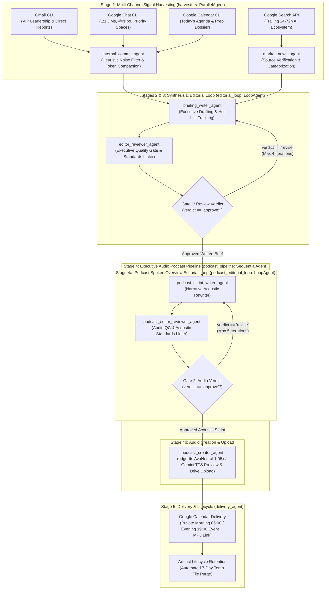

# Daily Brief

**Autonomous Executive AI Chief of Staff & Technical Intelligence Partner**  
Built with the [Google Agent Development Kit (ADK)](https://google.github.io/agent-development-kit/) and `agents-cli`.

---

## Overview

**Daily Brief** is an autonomous multi-agent executive intelligence system designed for Robert Sibo (Head of AI/Gemini Technical Go-to-Market, AuNZ). It eliminates communication fragmentation across Gmail, Google Chat, Google Calendar, and fast-moving external AI industry developments.

Instead of passively reporting news or dumping raw notifications, Daily Brief operates under a core executive philosophy:
> *"Do not report the news; report what requires a decision, an escalation, or immediate strategic awareness."*

The system synthesizes incoming signals across multiple channels, applies aggressive heuristic noise suppression, enforces a strict editorial review loop, and delivers intelligence through **dual modalities**:
1. **Dense Hyperlinked Text Briefing**: Scheduled as a private, transparent 30-minute Google Calendar event (`Your Morning Brief` at 06:00 AM Sydney time) with one-click deep links back to original email and chat threads.
2. **Executive Audio Podcast**: Spoken briefing (8–15 minutes) synthesized via Gemini Multimodal Text-to-Speech (TTS) with custom phonetic normalization, uploaded to Google Drive, and pinned at the top of the calendar brief.

---

## Architecture & Multi-Agent Pipeline

The system coordinates a hierarchical, multi-stage pipeline combining parallel harvesting, iterative editorial refinement, acoustic scripting, and automated delivery:



---

## Core Capabilities & Pipeline Stages

### 1. Multi-Source Signal Harvesting (`harvesters`)
- **Gmail Ingestion**: Queries unread emails strictly within a 24-hour lookback window (or 12-hour for afternoon) from key leadership (Simon Elisha, Mitesh Agarwal, Vamsi Ramakrishnan, etc.) and 15 direct reports.
- **Google Chat Ingestion**: Scans 1:1 unread direct messages, direct `@rsibo` mentions, and designated team spaces (configured dynamically in `config/chat_spaces.md`).
- **Calendar Dossier**: Extracts today's meetings in `Australia/Sydney` timezone, attendee lists, objectives, and prep links.
- **AI Market Movements**: Gathers foundation model updates, enterprise agent architectures, and hyperscaler announcements (GCP, AWS, Azure) via Google Search grounding with verified source citations.

### 2. Upstream Noise Suppression & Content Budgeting
- **Zero-Fluff Heuristics**: Automatically drops kudos (`noreply+gthanks@google.com`), calendar accept/decline notifications, Buganizer automated CCs, and mass newsletters before any LLM processing.
- **Strict Content Compaction**: Truncates snippets and email bodies at sentence boundaries (email snippets &le; 400 chars, bodies &le; 1,200 chars, chat snippets &le; 160 chars) to prevent context bloat and optimize token usage.

### 3. Structured Briefing Synthesis & Active Hot List Tracking
Generates a structured, email-ready HTML briefing formatted into distinct sections:
- **Executive Orientation**: Exactly 6 unbolded plain text sentences in a calm, authoritative Chief of Staff tone (titled `OVERNIGHT SUMMARY` for morning, `EXECUTIVE SUMMARY` for afternoon).
- **Core Updates & Leadership Directives**: Clustered by account or strategic topic with hyperlinked headers directly to threads, bolded entities, and recency anchors (e.g., *"Last response from Vamsi was Thursday"*).
- **Active Hot List Tracking**: Continuous 3-day monitoring of strategic priorities (e.g., *Optus VAIS Blocker*, *Woolworths GE/FLW*, *Google AI DRZ* from `config/hot_list.md`). If a theme has had no traffic, explicitly outputs: `"- On topic [Theme Name] no updates yet."`
- **Needs You / Action Tracker**: Checklist of unanswered direct questions, pending approvals, and mentions, flagged with aging indicators (`[Day 2 - Unanswered]`).
- **Today's Schedule Dossier**: Chronological breakdown of meetings with attendee context and prep recommendations.

### 4. Editorial Quality Gate (`editorial_loop`)
- An autonomous loop between `briefing_writer_agent` and `editor_reviewer_agent`.
- Audits drafts against executive communication standards: checks for prohibited hyperbole, verifies that all entity names are properly bolded, ensures section word budgets are respected, and confirms thread deep links are intact.
- Loops up to 4 iterations until explicitly approved.

### 5. Executive Audio Podcast Pipeline (`podcast_pipeline`)
- **Stage 4a: Podcast Spoken Overview Editorial Loop (`podcast_editorial_loop`)**:
  - Autonomous loop (`max_iterations=5`) pairing `podcast_script_writer_agent` (narrative acoustic rewriter) and `podcast_editor_reviewer_agent` (audio QC auditor).
  - Enforces mandatory `"Let's begin; "` opening hook (zero greeting pleasantries), transforms mechanical bracketed citations into smooth spoken prose, enforces 6–15 min runtime bounds (~800 to 2,400 words), linear sentence brevity (&le; 18 words), high contraction density (&ge; 80%), and eliminates 100% of markdown asterisks, bullet dashes, and visual artifacts via `lint_podcast_spoken_script`.
- **Stage 4b: Audio Creation & Cloud Delivery (`podcast_creator_agent`)**:
  - Synthesizes high-fidelity MP3 audio at 1.05x pace via `edge-tts` AvaNeural (or `gemini-3.1-flash-tts-preview`), uploads to Google Drive in folder `/agents/daily-briefing`, and injects a `Listen to Brief` badge link at the top of the calendar invitation.

### 6. Strategic Model Routing
Configured in `app/config.py` to optimize cost, latency, and reasoning depth:
- **`ANALYTICAL_MODEL` (`gemini-flash-latest`)**: Deep cross-channel correlation, briefing drafting, and strict editorial review auditing.
- **`THROUGHPUT_MODEL` (`gemini-flash-latest`)**: High-speed harvesting, noise classification, live search extraction, and delivery formatting.
- **`SPEECH_TTS_MODEL` (`gemini-3.1-flash-tts-preview`)**: Specialized multimodal audio model for expressive speech synthesis and tone inflection.

---

## Project Structure

```
daily-brief/
├── app/
│   ├── agent.py                     # Master Orchestrator (Parallel harvesters -> Editorial loop -> Podcast -> Delivery)
│   ├── config.py                    # Centralized configuration & strategic model routing
│   ├── fast_api_app.py              # FastAPI application & background execution workers
│   ├── app_utils/
│   │   ├── pii_scrubber.py          # Automated PII, email, and credential scrubbing
│   │   ├── telemetry.py             # Cloud Trace, BigQuery logging, and intent/outcome tracking
│   │   └── typing.py                # Strict Pydantic schemas (CommunicationItem, HarvestPayload, etc.)
│   ├── prompts/
│   │   └── constitution.py          # Chief of Staff persona, guidelines, and review criteria
│   ├── sub_agents/
│   │   ├── internal_comms_agent.py  # Gmail, Chat, and Calendar signal harvester
│   │   ├── market_news_agent.py     # External AI ecosystem and market news scanner
│   │   ├── briefing_writer_agent.py # Executive briefing synthesis agent
│   │   ├── editor_reviewer_agent.py # Executive quality and standards reviewer
│   │   ├── editorial_loop.py        # Coordinated iterative feedback loop
│   │   ├── podcast_script_agent.py  # Written-to-spoken acoustic script adapter
│   │   ├── podcast_creator_agent.py # Gemini TTS audio generator & Drive uploader
│   │   └── delivery_agent.py        # Calendar event dispatcher & artifact cleanup worker
│   └── tools/
│       ├── internal_comms_tools.py  # CLI wrappers, noise suppression, and content compaction
│       ├── market_news_tools.py     # Search API queries and verified source extraction
│       ├── synthesis_tools.py       # HTML briefing assembly and Hot List qualification
│       ├── editor_tools.py          # Standards validation and formatting linter
│       ├── podcast_tools.py         # TTS pipeline, phonetic normalization, and Drive upload
│       └── delivery_tools.py        # Google Calendar scheduling and 7-day file retention
├── config/
│   ├── chat_spaces.md               # Target Google Chat rooms and space IDs
│   └── hot_list.md                  # Strategic initiative themes, query syntax, and aliases
├── infra/
│   └── terraform/                   # Production Cloud Run, GCS bucket, and IAM service accounts
├── tests/
│   ├── unit/                        # Unit tests across all agents, tools, and schemas
│   ├── integration/                 # End-to-end integration tests for multi-agent workflows
│   └── eval/                        # Golden evaluation datasets and automated test harnesses
├── GEMINI.md                        # Coding agent operating rules and guidelines
├── PRD.md                           # Comprehensive Product Requirements Document
└── pyproject.toml                   # Project dependencies, packaging, and tool settings
```

---

## Configuration

### Monitored Chat Spaces (`config/chat_spaces.md`)
Specify key Google Chat spaces for the agent to monitor:
```markdown
| Space Name | Space Resource ID | Focus / Priority |
| :--- | :--- | :--- |
| AuNZ AI CE Team | `spaces/AAAAxxxxxxx` | Customer engineering announcements |
| AuNZ AI FDE Team | `spaces/AAAAyyyyyyy` | Forward-deployed engineer blockers |
```

### Active Hot List (`config/hot_list.md`)
Add or modify high-priority initiatives tracked across Gmail and Chat:
```markdown
| Theme Name | Query Syntax | Aliases / Keywords | Priority Focus |
| :--- | :--- | :--- | :--- |
| **Optus VAIS Blocker** | `Optus AND (VAIS OR "Model Armor")` | Optus, VAIS, Armor | Commercial & technical blocker |
| **Woolworths Initiatives** | `Woolworths AND (GE OR FLW OR SWE)` | Woolies, WOW, FLW | Strategic enterprise account |
```

---

## Getting Started

### Prerequisites
- **Python 3.11+**
- **uv**: Python package and project manager (`curl -LsSf https://astral.sh/uv/install.sh | sh`)
- **agents-cli**: Google Agents CLI (`uv tool install google-agents-cli`)
- **Google Cloud SDK**: Authenticated with Vertex AI permissions (`gcloud auth application-default login`)

### Installation
Install project dependencies into a managed virtual environment:
```bash
agents-cli install
```

### Running Locally (Interactive Playground)
Launch the interactive web-based ADK development environment:
```bash
agents-cli playground
```
Once started, access the UI via your Cloudtop proxy URL:
`http://rsibo.c.googlers.com:8000` (or designated port).

### Running Tests & Quality Checks
Execute the automated test suites:
```bash
# Run unit and integration tests
uv run pytest tests/unit tests/integration

# Run code quality linting
agents-cli lint
```

---

## Deployment & Operations

### Deployment
To deploy the agent to Google Cloud (Cloud Run / Vertex AI Agent Runtime):
```bash
gcloud config set project <your-project-id>
agents-cli deploy
```

### Enterprise Observability & Security
- **Cloud Trace & Logging**: Real-time execution tracing with per-subagent spans and tool execution logs.
- **PII Redaction**: Built-in regex scrubbers in `app/app_utils/pii_scrubber.py` strip sensitive email addresses, credentials, and customer identifiers before telemetry export.
- **Automated Lifecycle Cleanup**: Ephemeral audio files and temporary scratch items are automatically purged after 7 days via `cleanup_pipeline_artifacts`.
