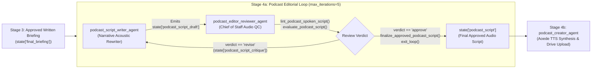

# Product Requirements Document (PRD)
## Sub-Agent Architecture: Podcast Spoken Overview Editorial Loop

**Document Version:** 1.0  
**Status:** Approved for Implementation  
**Target User / Principal:** Robert Sibo (`rsibo@google.com`), Head of AI/Gemini Technical Go-to-Market (AuNZ)  
**Framework:** Google Agent Development Kit (ADK) & `agents-cli`  
**Workspace:** `/usr/local/google/home/rsibo/.gemini/jetski/battle-overlays/daily-brief/fork-48432786-0/mount`  
**Related Skill:** `audio-overview-script-editor` (`config/skills/audio-overview-script-editor/SKILL.md`)  

---

## 1. Executive Summary & Problem Statement

### 1.1 Context
In the Daily Brief pipeline, Stage 2/3 produces an email-friendly, highly formatted executive written briefing (`final_html`) approved by the Chief of Staff editor loop. In the original implementation, Stage 4 adapted this written briefing for audio using deterministic regular expressions that stripped HTML tags, bullet points, and headers.

### 1.2 The Problem
Visual written briefings are inherently different from spoken audio briefs ("written for the eye" vs. "written for the ear"):
1. **Mechanical Metadata Citations:** Written briefs include bracketed citation headers (e.g. `[Google DeepMind - 2026-09-02] Releases GPT-6 Astra`). In audio, reading date stamps and brackets sounds robotic, disjointed, and unnatural.
2. **Dense Sentence Structure & Excessive Length:** Written briefs use multi-clause sentences, passive voice, and uncontracted verbs. This causes cognitive fatigue when listening during a morning commute.
3. **Lack of Conversational Flow:** A regex replacement replaces headers with rigid phrases but cannot rephrase bulleted lists into a continuous narrative.
4. **Need for Quality Enforcement:** An unconstrained single-shot generative rewrite risks re-introducing conversational fluff ("Hey Rob, welcome back!"), buzzwords, or hallucinations that the Stage 3 Chief of Staff loop had eliminated.

### 1.3 The Solution
Implement a dedicated **Podcast Editorial Loop** (`LoopAgent`, `max_iterations=5`) in Stage 4 composed of two specialized sub-agents:
1. **`podcast_script_writer_agent`**: Rewrites the approved briefing into a punchy, high-tempo, narrative spoken script adhering to the `audio-overview-script-editor` skill.
2. **`podcast_editor_reviewer_agent`**: Audits the draft script against acoustic standards, verifies zero visual artifacts, enforces contraction density, caps sentence lengths, checks anti-hyperbole rules, and either provides targeted critique or approves and terminates the loop via `finalize_approved_podcast_script` and `exit_loop`.



---

## 2. Target Persona & Acoustic Principles

### 2.1 Persona: Executive Chief of Staff Audio Briefing
- **Tone:** Decisive, crisp, authoritative, high-tempo, calm.
- **Audience:** Robert Sibo (`rsibo@google.com`) listening while walking or commuting.
- **Pacing:** 130–150 words per minute; delivery tailored for 1.05x speed synthesis.
- **Target Runtime:** 2.5 to 4.5 minutes (~350 to 700 words).

### 2.2 Acoustic Transformation Matrix (The "Written-to-Spoken" Rules)

| Written Visual Artifact | Audio Anti-Pattern | Acoustic Target Rule | Concrete Example |
|---|---|---|---|
| **Bracketed Citations** | Reading raw dates & brackets | Active narrative phrasing | `[Google DeepMind - 2026-09-02] Releases GPT-6` $\rightarrow$ *"Google DeepMind released GPT-6..."* |
| **Markdown / Bullets** | Reading dashes, stars, tags | Continuous spoken transitions | `* Optus VAIS: No updates yet.` $\rightarrow$ *"Turning to our hot list priorities: no new movements on Optus Model Armor or local processing."* |
| **Formal Syntax** | Rigid uncontracted auxiliary verbs | Spoken contractions ($\ge 80\%$ density) | *"We have received"* $\rightarrow$ *"We've received"*, *"There is"* $\rightarrow$ *"There's"* |
| **Nested Clauses** | Sentences over 20 words | Linear **Subject $\rightarrow$ Verb $\rightarrow$ Object** | Max 18 words per sentence. Split complex sentences into two punchy statements. |
| **Pacing & Cadence** | Monotone delivery | Em-dashes (`—`) & ellipses (`...`) | Insert half-second breathing pauses before key statistics or outcomes. |
| **Acronyms** | Mispronounced words (`VAIS`) | Phonetic hyphenation | `V-A-I-S`, `S-W-E`, `D-R-Z`, `F-L-W`, `A-P-A-C` |
| **Opening Pleasantries** | Host banter ("Good morning Rob!") | Zero-Fluff Opening | Open directly with the lead operational orientation. |

---

## 3. Sub-Agent Detailed Specifications

### 3.1 Sub-Agent 1: `podcast_script_writer_agent`
- **Agent Type:** ADK `Agent` (LLM-backed)
- **Model:** `THROUGHPUT_MODEL` (`gemini-flash-latest`)
- **System Instruction:** Embedded with `CHIEF_OF_STAFF_CONSTITUTION` and `audio-overview-script-editor` directives.
- **Input State Keys:**
  - `state['final_briefing']`: Approved written HTML briefing.
  - `state['podcast_script_critique']`: Actionable feedback from previous editor iteration (if revising).
- **Output Key:** `state['podcast_script_draft']`
- **Core Directives:**
  1. Digest the factual content of `{final_briefing}`.
  2. Rewrite into a linear, conversational spoken script structured into natural paragraphs separated by blank lines.
  3. Transform all bracketed sources (`[Company - Date] Action`) into natural narrative phrases.
  4. Enforce strict sentence brevity (cap at 18 words/sentence) and high contraction density ($\ge 80\%$).
  5. Strip 100% of markdown syntax (`*`, `#`, `_`, `[ ]`, `>`, bullets).

---

### 3.2 Sub-Agent 2: `podcast_editor_reviewer_agent`
- **Agent Type:** ADK `Agent` (LLM-backed with deterministic linting tools)
- **Model:** `ANALYTICAL_MODEL` (`gemini-2.5-pro` or `gemini-flash-latest`)
- **System Instruction:** Audio Quality Control & VP Briefing Auditor.
- **Tools:**
  - `lint_podcast_spoken_script`: Automated regex and heuristic linter.
  - `evaluate_podcast_script`: Structured evaluation returning `verdict` (`approve` | `revise`).
  - `finalize_approved_podcast_script`: Serializes approved payload into `state['podcast_script']` and sets `tool_context.actions.escalate = True`.
  - `exit_loop`: Built-in ADK tool to terminate the `LoopAgent`.
- **Pre-Emission Linter Checklist:**

| Checklist Item | Validation Criteria | Automated Check |
|---|---|---|
| **Zero Visual Artifacts** | Zero markdown asterisks, hashes, brackets, bullets (`- `, `* `). | Regex pattern scan |
| **No Bracketed Sources** | Zero bracketed date or company tags (e.g. `[OpenAI...]`). | Regex pattern scan |
| **No Robotic Counting** | Does not contain *"item number one"*, *"firstly"*, *"secondly"*. | Word boundary search |
| **Contraction Density** | Spoken contractions used in $\ge 80\%$ of applicable verb pairs. | Contraction ratio check |
| **Sentence Brevity** | Zero sentences exceeding 18 words. | Sentence token count |
| **Clean Opening** | Opens directly with operational signal; no greeting or intro fluff. | Opening phrase filter |
| **Hyperbole Ban** | Prohibits unquoted buzzwords (*"game-changer"*, *"critical emergency"*). | Banned vocabulary scan |
| **Word Limit** | Total word count between 250 and 750 words. | Word count check |

---

### 3.3 Loop Orchestration: `podcast_editorial_loop`
- **Agent Type:** ADK `LoopAgent`
- **Max Iterations:** `5`
- **Sub-agents:** `[podcast_script_writer_agent, podcast_editor_reviewer_agent]`
- **Convergence Behavior:**
  - On Iteration 1: Writer produces initial draft; Reviewer runs `evaluate_podcast_script`. If clean, Reviewer calls `finalize_approved_podcast_script`, `exit_loop`, and the loop exits immediately in 1 round.
  - If issues are detected (e.g. sentences > 18 words, bracketed source left in): Reviewer returns critique into session state.
  - On Iterations 2–5: Writer repairs the specific issues pointed out in critique.
  - Max Iteration Fallback: If iteration 5 concludes without explicit exit, `podcast_creator_agent` can still consume the highest-quality draft committed.

---

## 4. Session State Contract & Schema

```python
class PodcastScriptDraftPayload(BaseModel):
    """Working draft produced by podcast_script_writer_agent."""
    spoken_script_draft: str = Field(..., description="Draft spoken script")
    iteration: int = Field(default=1, description="Loop iteration counter")
    generated_at: str = Field(..., description="ISO 8601 timestamp")

class PodcastReviewCritiquePayload(BaseModel):
    """Critique produced by podcast_editor_reviewer_agent."""
    verdict: Literal["approve", "revise"] = Field(...)
    critique: str = Field(..., description="Actionable critique for revisions")
    issues: list[str] = Field(default_factory=list)
    passed: bool = Field(...)

class PodcastScriptPayload(BaseModel):
    """Finalized and approved spoken script passed to podcast_creator_agent."""
    spoken_script: str = Field(..., description="Approved spoken script")
    word_count: int = Field(...)
    estimated_duration_seconds: int = Field(...)
    generated_at: str = Field(...)
```

---

## 5. Implementation & Migration Steps

1. **Skill Definition:** Save `audio-overview-script-editor` skill at `config/skills/audio-overview-script-editor/SKILL.md`.
2. **Tools Layer:** Implement `app/tools/podcast_editor_tools.py` containing:
   - `lint_podcast_spoken_script`
   - `evaluate_podcast_script`
   - `finalize_approved_podcast_script`
3. **Sub-Agent Definitions:**
   - Create `app/sub_agents/podcast_script_writer_agent.py`
   - Create `app/sub_agents/podcast_editor_reviewer_agent.py`
   - Create `app/sub_agents/podcast_editorial_loop.py`
   - Maintain alias in `app/sub_agents/podcast_script_agent.py` for backwards compatibility.
4. **Orchestrator Integration:** Update `podcast_pipeline` in `app/agent.py` to sequence `podcast_editorial_loop` followed by `podcast_creator_agent`.
5. **Unit & Integration Testing:** Add comprehensive tests in `tests/unit/test_podcast_editorial_loop.py` and verify zero regressions on existing tests.
